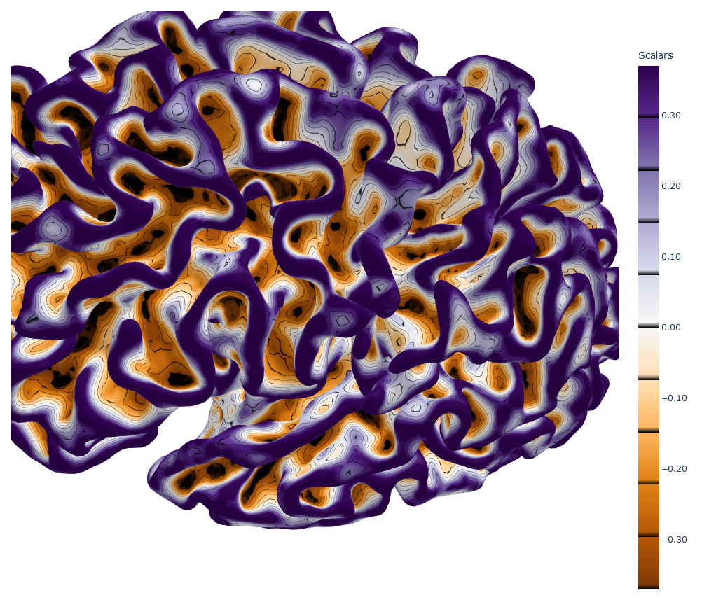
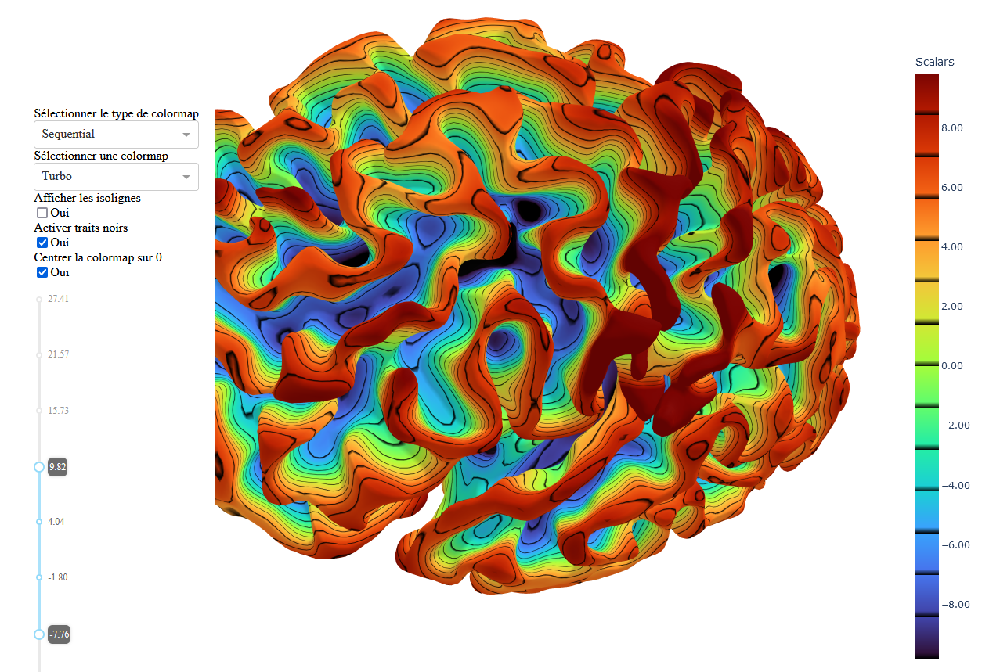
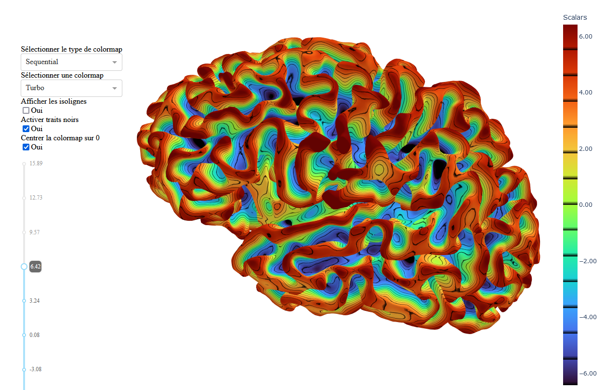
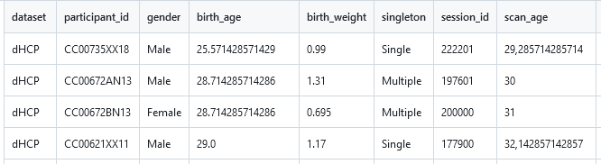

# DPF-STAR Repository

[](https://doi.org/10.5281/zenodo.14163623)


## Introduction
This repository contains the code associated with the paper: **"New Scale-Invariant Sulcal Depth Measure: A Response to the Conceptual and Methodological Problems of Sulcal Depth Estimation."** 

The code here provides tools to compute curvature and a novel DPF-STAR depth measure for brain surface meshes, addressing limitations in traditional sulcal depth estimation methods.

## Table of Contents  
1. [Installation](#installation) 
2. [Repository Organization](#organization) 
3. [Worspace Configuration](#configuration)
4. [How to use the App](#app)  
5. [Data and Scripts](#scripts)


<a name="installation"/>

## Installation

Follow these steps to set up and run this project on your machine.

### Prerequisites

- Make sure **Conda** is installed on your machine.  
  You can download Miniconda or Anaconda here:  
  - [Miniconda](https://docs.conda.io/en/latest/miniconda.html)  
  - [Anaconda](https://www.anaconda.com/products/distribution)  

- Ensure that `bash` is available (commonly pre-installed on Linux and macOS, or via Git Bash on Windows).

### Installation Steps

#### Option 1 : automatic installation (via conda env)
1. Fork and Clone this repository:
```bash
git clone https://github.com/your-username/DPF-star .git
cd DPF-star
```
2. Run the installation script:
```bash
./install.sh
```
This script will:
* Create a Conda environment using the environment.yml file.
* Activate the newly created environment.

If the script does not execute, make sure it is executable:
 ```bash
chmod +x install.sh
```
#### Option 2 : manual installation (via conda env)
If you prefer not to use the script, here are the manual steps:
1. Create the Conda environment from the environment.yml file:
```bash
conda env create -f environment.yml
```
2. Activate the Conda environment:
```bash
conda activate your_project_name
```

<a name="organization"/>

## Repository Organization
There are 3 main files in this repo : 
(1) app : functions you can run on command line and allow you to use the dpf-star method for your own studies.
(2) scripts : the scripts used for the different experience introduced in the article.
(3) functions : functions useful both for the app and the scripts.
The repository is organized as follows:

```plaintext
DPF-STAR/
├── app/                       # Application for using the DPF-STAR method on custom data
│   ├── compute_curvature.py   # Script for computing mesh curvature
│   ├── compute_dpfstar.py     # Script for computing the DPF-STAR depth
│   └── visualiser.py          # Script for visualizing textures on meshes
├── fonctions/                 # Utility functions used by the app
│   ├── curvature.py
│   ├── dpf.py
│   ├── dpfstar.py
│   ├── laplacian.py
│   ├── rw.py
│   ├── topology.py
│   └── texture.py
├── scripts/                   # Scripts used in experiments for the paper
│   ├── scripts_EXP1.py
│   ├── scripts_EXP2.py
│   ├── scripts_EXP3.py
│   └── scripts_EXP4.py
└── setup.py                   # Setup file for installing the package
```

<a name="configuration"/>

## Workspace Configuration
Before running the app, adjust the workspace configuration to ensure smooth operation:

1. Update `.vscode/settings.json` with the correct project root directory path.
2. Update `.vscode/launch.json` with the correct project root directory path.
3. Adjust the `config.py` file to point to the correct project root directory.

<a name="app"/>

## How to Use the App

### Configuration Steps
1. **Navigate to the project root directory:**
   ```bash
   cd path/to/DPF-STAR
   ```

2. **Upgrade pip and setuptools:**
   ```bash
   pip install --upgrade setuptools pip
   ```

3. **Install the package in development mode:**
   ```bash
   pip install -e .
   ```

### Usage Overview
The app allows you to:
- Compute the **curvature** of a mesh.
- Calculate the **DPF depth** of a mesh.
- Calculate the **DPF-STAR depth** of a mesh.
- Quickly visualize the **texture** applied on the mesh.

### Commands

#### 1. Compute Curvature
To compute the curvature of a mesh, run:
```bash
python -m app.compute_curvature {path/to/your/mesh} --display
```
Replace `{path/to/your/mesh}` with the actual path to your mesh file.
- If the `--display` argument is added, the script will automatically run the dash code for visualising the mesh with the curvature texture.

Here a screenshot of what you get with the example mesh : 


#### 2. Compute DPF Depth
To calculate the DPF depth of a mesh, use:
```bash
python -m app.compute_dpf {path/to/your/mesh} --curvature {curvature/path} --display
```
- If the `--curvature` argument is not specified, the script will look for a curvature file in the corresponding folder or compute it if necessary.
- If the `--display` argument is added, the script will automatically run the dash code for visualising the mesh with the dpf texture.

Here a screenshot of what you get with the example mesh : 


#### 3. Compute DPF-STAR Depth
To calculate the DPF-STAR depth of a mesh, use:
```bash
python -m app.compute_dpfstar {path/to/your/mesh} --curvature {curvature/path} --display
```
- If the `--curvature` argument is not specified, the script will look for a curvature file in the corresponding folder or compute it if necessary.
- If the `--display` argument is added, the script will automatically run the dash code for visualising the mesh with the dpf-star texture.

Here a screenshot of what you get with the example mesh : 


#### 4. Visualize Textures
To visualize textures on a mesh, use the following command:
```bash
python -m app.visualiser {path/to/your/mesh} --texture {texture/path} 
```
Replace `{path/to/your/mesh}` and `{texture/path}` with the paths to your mesh and texture files, respectively.

you will get :
```bash
Dash is running on http://XXX.X.X.X:XXXX/

 * Serving Flask app 'visualizer'
 * Debug mode: on
```
simply copy paste the url http://XXX.X.X.X:XXXX/ is your internet browser

<a name="scripts"/>

## Data and scripts of the paper

### 1. Experience 1.

#### a. Dataset manually labelised

The informations relative to the datasets are stored in the folder ./data/dataset_EXP1.csv

